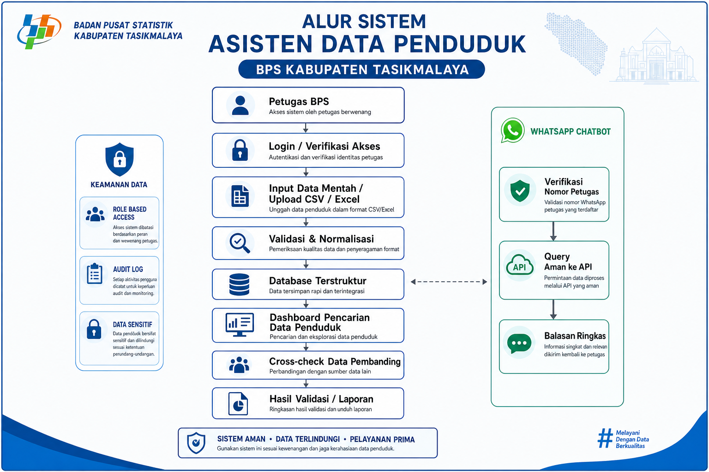
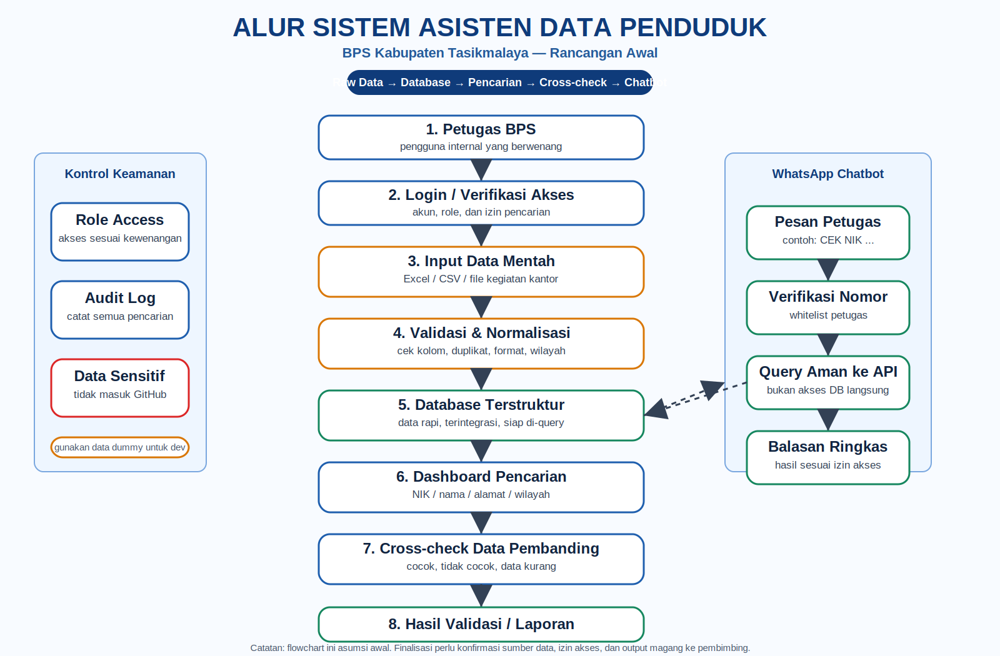

# Asisten Data Penduduk BPS Kabupaten Tasikmalaya

Rancangan awal aplikasi internal untuk membantu petugas mencari, merapikan, dan melakukan cross-check data kependudukan. Repositori ini dibuat **private** karena konteksnya berhubungan dengan data sensitif.

## Pemahaman Awal

Kemungkinan besar maksud "datanya di-database-kan" adalah:

1. Data awal dari kantor masih bisa berupa **raw data**: Excel, CSV, spreadsheet, atau file hasil kegiatan.
2. Data tersebut perlu melalui proses **validasi, normalisasi, dan pembersihan**.
3. Setelah rapi, data dimasukkan ke **database terstruktur**.
4. Aplikasi/web dashboard dan WhatsApp chatbot membaca data dari database/API, bukan langsung dari file mentah.

Jadi alurnya bukan langsung bikin chatbot dulu, tapi:

> raw data → validasi/cleaning → database → dashboard pencarian → cross-check → laporan/chatbot

## Flowchart Utama

### Versi image generation

> Catatan: gambar ini dibuat dengan image generation, jadi cocok untuk ilustrasi/presentasi awal. Untuk label yang benar-benar presisi, pakai versi SVG teknis di bawahnya.

### Versi teknis yang labelnya presisi

## Fitur Awal yang Diusulkan

### 1. Manajemen Data Mentah

- Upload/import data dari Excel/CSV.
- Validasi kolom wajib.
- Deteksi data kosong, duplikat, format salah, atau data tidak konsisten.
- Normalisasi data wilayah, nama, tanggal, dan field penting lain.

### 2. Database Terstruktur

- Data penduduk disimpan dalam tabel yang rapi.
- Database bisa berisi data penduduk, wilayah, hasil survei/kegiatan, dan data pembanding lain sesuai izin kantor.
- Semua akses data harus dicatat melalui audit log.

### 3. Dashboard Pencarian Petugas

- Login petugas.
- Pencarian berdasarkan NIK/nama/wilayah/alamat/parameter lain yang diizinkan.
- Tampilan hasil ringkas dan detail sesuai role akses.
- Filter dan export laporan jika diizinkan.

### 4. Cross-check Data

- Mencocokkan data penduduk dengan data pembanding.
- Menampilkan status: cocok, tidak cocok, data kurang, atau perlu verifikasi.
- Menampilkan field yang berbeda supaya petugas tahu bagian mana yang perlu dicek.

### 5. WhatsApp Chatbot

- Nomor petugas harus terdaftar/whitelist.
- Bot hanya menerima format perintah tertentu.
- Bot memanggil API internal secara aman.
- Bot membalas hasil ringkas, bukan data sensitif lengkap.

## Dokumen di Repo Ini

- [`docs/RANCANGAN_AWAL.md`](docs/RANCANGAN_AWAL.md) — penjelasan konsep sistem.
- [`docs/PERTANYAAN_PEMBIMBING.md`](docs/PERTANYAAN_PEMBIMBING.md) — daftar pertanyaan yang harus ditanyakan ke pembimbing.
- [`docs/flowchart.md`](docs/flowchart.md) — flowchart dalam Mermaid.
- [`docs/assets/flowchart-imagegen.png`](docs/assets/flowchart-imagegen.png) — gambar flowchart hasil image generation.
- [`docs/assets/flowchart-teknis.svg`](docs/assets/flowchart-teknis.svg) — flowchart teknis presisi.

## Catatan Keamanan

Karena ini berhubungan dengan data kependudukan, jangan memasukkan data asli ke repo. Gunakan data dummy/sintetis untuk pengembangan awal.
