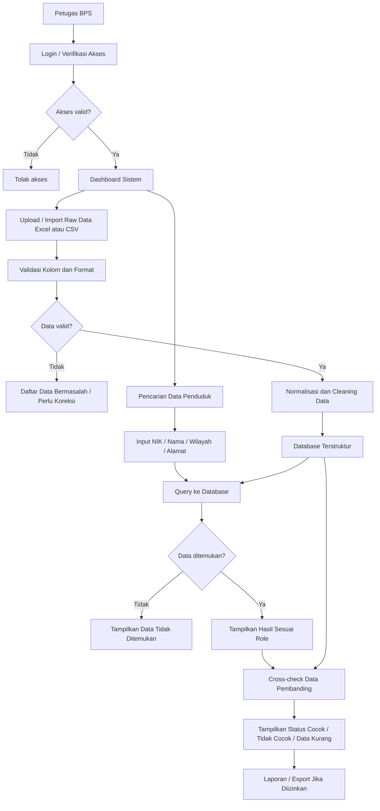
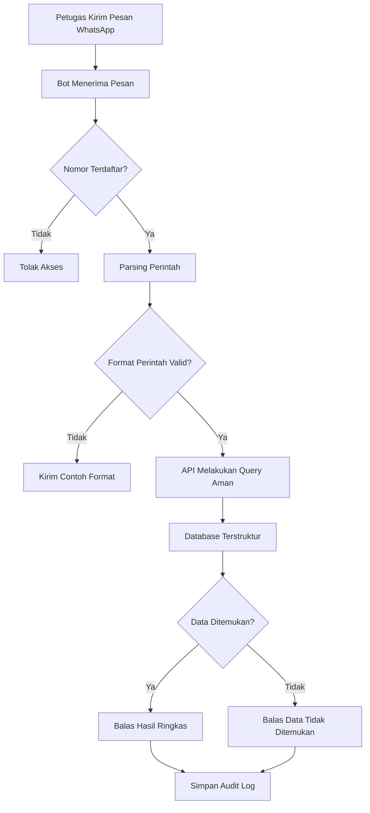

# Flowchart Sistem

## Alur Utama

```mermaid
flowchart TD
    A[Petugas BPS] --> B[Login / Verifikasi Akses]
    B --> C{Akses valid?}
    C -- Tidak --> D[Tolak akses]
    C -- Ya --> E[Dashboard Sistem]

    E --> F[Upload / Import Raw Data Excel atau CSV]
    F --> G[Validasi Kolom dan Format]
    G --> H{Data valid?}
    H -- Tidak --> I[Daftar Data Bermasalah / Perlu Koreksi]
    H -- Ya --> J[Normalisasi dan Cleaning Data]
    J --> K[Database Terstruktur]

    E --> L[Pencarian Data Penduduk]
    L --> M[Input NIK / Nama / Wilayah / Alamat]
    M --> N[Query ke Database]
    N --> O{Data ditemukan?}
    O -- Tidak --> P[Tampilkan Data Tidak Ditemukan]
    O -- Ya --> Q[Tampilkan Hasil Sesuai Role]

    Q --> R[Cross-check Data Pembanding]
    R --> S[Tampilkan Status Cocok / Tidak Cocok / Data Kurang]
    S --> T[Laporan / Export Jika Diizinkan]

    K --> N
    K --> R
```

## Alur WhatsApp Chatbot

```mermaid
flowchart TD
    A[Petugas Kirim Pesan WhatsApp] --> B[Bot Menerima Pesan]
    B --> C{Nomor Terdaftar?}
    C -- Tidak --> D[Tolak Akses]
    C -- Ya --> E[Parsing Perintah]
    E --> F{Format Perintah Valid?}
    F -- Tidak --> G[Kirim Contoh Format]
    F -- Ya --> H[API Melakukan Query Aman]
    H --> I[Database Terstruktur]
    I --> J{Data Ditemukan?}
    J -- Tidak --> K[Balas Data Tidak Ditemukan]
    J -- Ya --> L[Balas Hasil Ringkas]
    L --> M[Simpan Audit Log]
    K --> M
```
